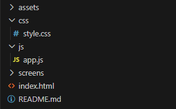

# TaskFlow — веб-приложение для управления задачами

## Актуальность темы

В современном мире пользователи ежедневно сталкиваются с необходимостью планирования задач, организации рабочего процесса и контроля личной продуктивности. Многие люди используют различные цифровые инструменты для управления задачами, однако значительная часть существующих решений либо перегружена функционалом, либо требует платной подписки.

Разработка собственного веб-приложения для управления задачами является актуальной задачей, поскольку позволяет создать удобный и интуитивно понятный инструмент для организации повседневной деятельности. Кроме того, тема позволяет применить современные технологии веб-разработки, изучить основы проектирования пользовательского интерфейса и реализовать клиентскую логику взаимодействия пользователя с системой.

## Целевая аудитория

Целевой аудиторией проекта являются:

- студенты;
- школьники;
- начинающие специалисты;
- пользователи, которым необходим простой инструмент для планирования задач.

Приложение ориентировано на пользователей, которым важны:

- удобство интерфейса;
- высокая скорость работы;
- простота использования;
- визуальное отображение прогресса выполнения задач.

## Функциональные возможности

Уже частично или полностью реализованы следующие функции:

- добавление новых задач
- редактирование задач
- удаление задач
- отметка задач как выполненных
- фильтрация задач (все / активные / выполненные)
- поиск задач
- сортировка задач
- отображение прогресса выполнения
- категории задач (учёба, работа, дом, личное)
- приоритет задач
- тёмная / светлая тема
- сохранение данных в LocalStorage
- визуальные анимации (GIF-уведомления)

## Используемые технологии

Для разработки проекта используется:

- HTML5
- CSS3 (Flexbox, Grid, адаптивная верстка)
- JavaScript
- LocalStorage API
- Visual Studio Code
- Git / GitHub

## Архитектура проекта

Проект состоит из следующих основных частей:

- интерфейс (HTML + CSS)
- логика приложения (JavaScript)
- хранение данных (LocalStorage)
- визуальные эффекты (анимации и GIF)

## Use-case диаграмма

Диаграмма отображает взаимодействие пользователя с системой TaskFlow.

## Скриншоты интерфейса

### Главный экран

### Активные задачи

### Выполненные задачи

### Тёмная тема

## Структура проекта

## Ожидаемый результат

Результатом проекта станет веб-приложение для управления задачами с современным пользовательским интерфейсом и базовым функционалом планировщика задач.

Приложение должно обеспечивать:

- удобное взаимодействие пользователя с задачами;
- быстрое добавление и редактирование информации;
- наглядное отображение текущего состояния задач;
- сохранение пользовательских данных между сессиями.