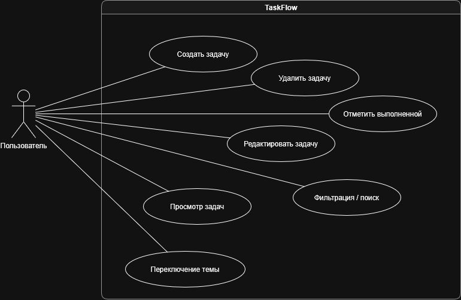
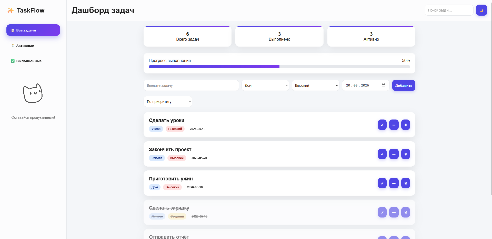
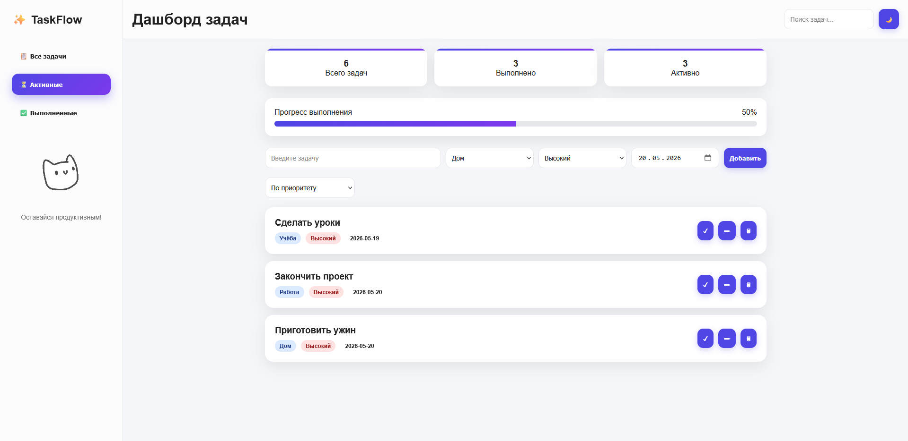
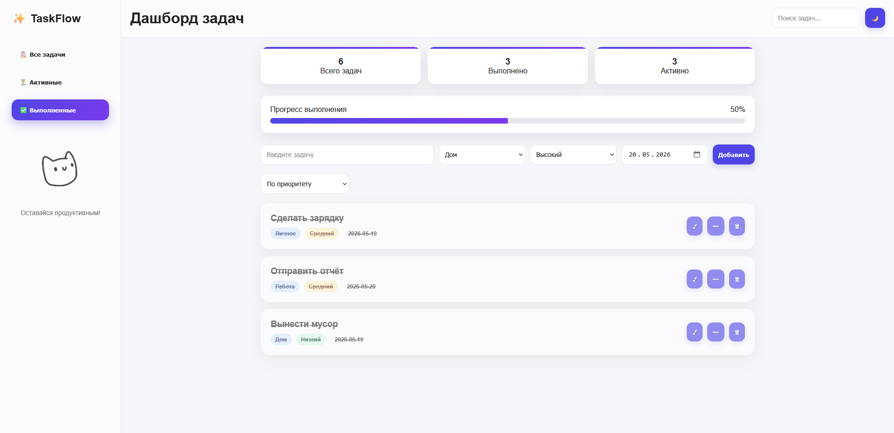
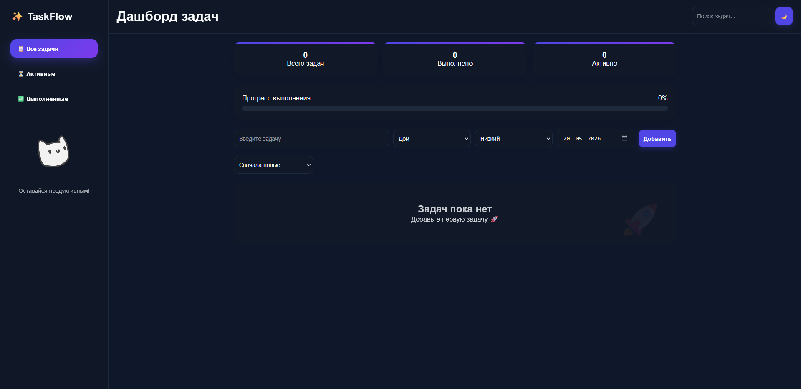
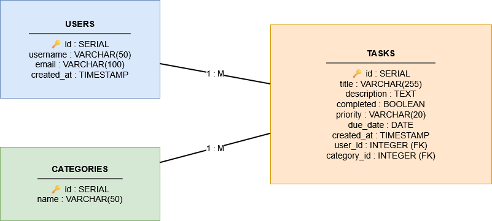
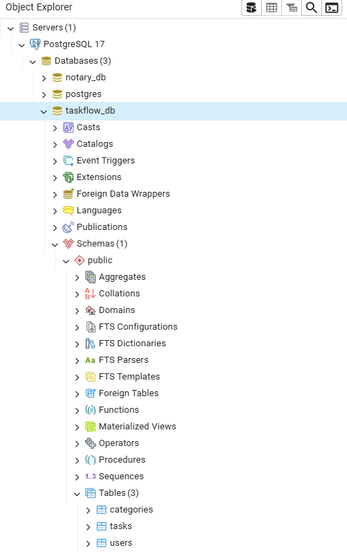
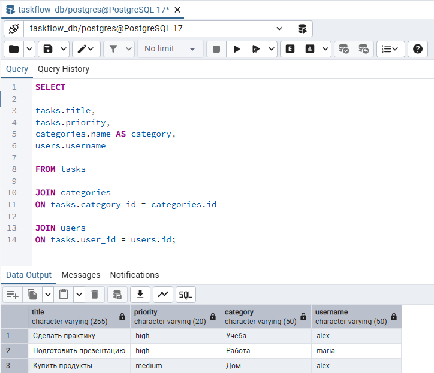
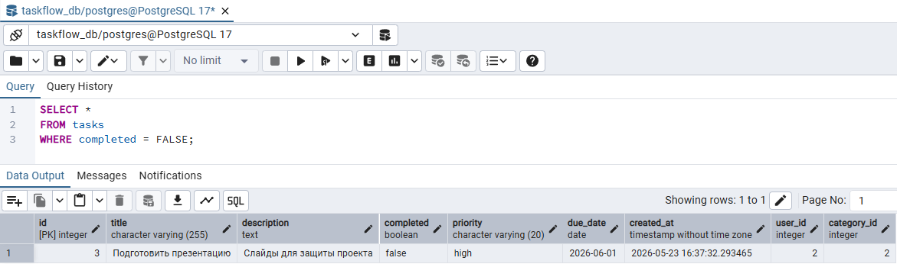

# TaskFlow — веб-приложение для управления задачами

---

# Актуальность темы

В современном мире пользователи ежедневно сталкиваются с необходимостью планирования задач, организации рабочего процесса и контроля личной продуктивности. Многие люди используют различные цифровые инструменты для управления задачами, однако значительная часть существующих решений либо перегружена функционалом, либо требует платной подписки.

Разработка собственного веб-приложения для управления задачами является актуальной задачей, поскольку позволяет создать удобный и интуитивно понятный инструмент для организации повседневной деятельности. Кроме того, тема позволяет применить современные технологии веб-разработки, изучить основы проектирования пользовательского интерфейса и реализовать клиентскую логику взаимодействия пользователя с системой.

---

# Целевая аудитория

Целевой аудиторией проекта являются:

- студенты;
- школьники;
- начинающие специалисты;
- пользователи, которым необходим простой инструмент для планирования задач.

Приложение ориентировано на пользователей, которым важны:

- удобство интерфейса;
- высокая скорость работы;
- простота использования;
- визуальное отображение прогресса выполнения задач.

---

# Функциональные возможности

В приложении реализованы следующие функции:

- добавление новых задач;
- редактирование задач;
- удаление задач;
- отметка задач как выполненных;
- фильтрация задач (все / активные / выполненные);
- поиск задач;
- сортировка задач;
- отображение прогресса выполнения;
- категории задач (учёба, работа, дом, личное);
- приоритет задач;
- тёмная / светлая тема;
- сохранение данных в LocalStorage;
- визуальные анимации (GIF-уведомления).

---

# Используемые технологии

Для разработки проекта используются:

- HTML5;
- CSS3 (Flexbox, Grid, адаптивная верстка);
- JavaScript;
- LocalStorage API;
- Visual Studio Code;
- Git / GitHub;
- PostgreSQL;
- pgAdmin 4.

---

# Архитектура проекта

Проект состоит из следующих основных частей:

- интерфейс (HTML + CSS);
- логика приложения (JavaScript);
- хранение данных (LocalStorage);
- база данных PostgreSQL;
- визуальные эффекты (анимации и GIF).

---

# Use-case диаграмма

Диаграмма отображает взаимодействие пользователя с системой TaskFlow.



---

# Скриншоты интерфейса

### Главный экран


### Активные задачи


### Выполненные задачи


### Тёмная тема


---

# Структура проекта

```text
TASK-TRACKER/
│
├── assets/
│   └── gifs/
│
├── css/
│   └── style.css
│
├── database/
│   ├── taskflow.sql
│   ├── queries.sql
│   ├── er-diagram.png
│
├── js/
│   └── app.js
│
├── screens/
│   ├── database/
│   └── скриншоты интерфейса
│
├── index.html
└── README.md
```

---

# Ожидаемый результат

Результатом проекта является веб-приложение для управления задачами с современным пользовательским интерфейсом и базовым функционалом планировщика задач.

Приложение обеспечивает:

- удобное взаимодействие пользователя с задачами;
- быстрое добавление и редактирование информации;
- наглядное отображение текущего состояния задач;
- сохранение пользовательских данных между сессиями.

---

# Реализация базы данных PostgreSQL

Для проекта была спроектирована и реализована реляционная база данных PostgreSQL.

Структура базы данных включает таблицы:

- users;
- tasks;
- categories.

В базе данных реализованы:

- первичные ключи (PK);
- внешние ключи (FK);
- связи между таблицами;
- SQL-запросы SELECT / INSERT / UPDATE / DELETE / JOIN.

---

# ER-диаграмма базы данных

Диаграмма отображает структуру таблиц и связи между ними.



---

# PostgreSQL Database

### Структура базы данных


### SELECT JOIN запрос


### SELECT WHERE запрос


---

# SQL-скрипты

SQL-скрипты находятся в папке:

```text
/database
```

Основные файлы:

- `taskflow.sql` — создание структуры базы данных и заполнение таблиц;
- `queries.sql` — примеры SQL-запросов.

---